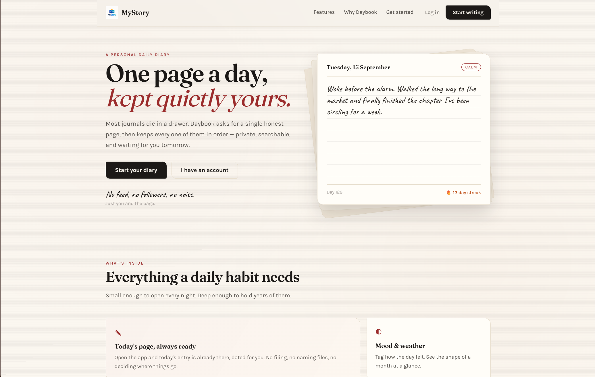
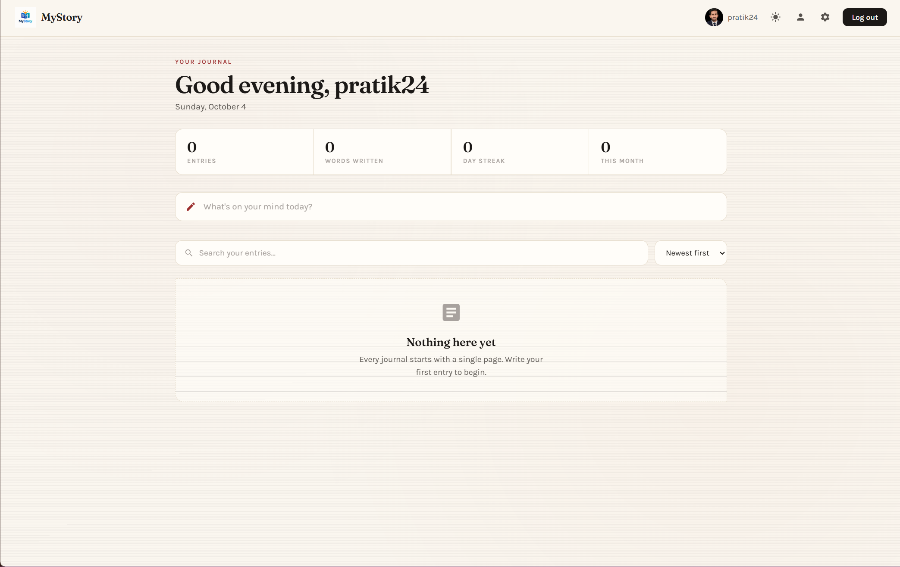
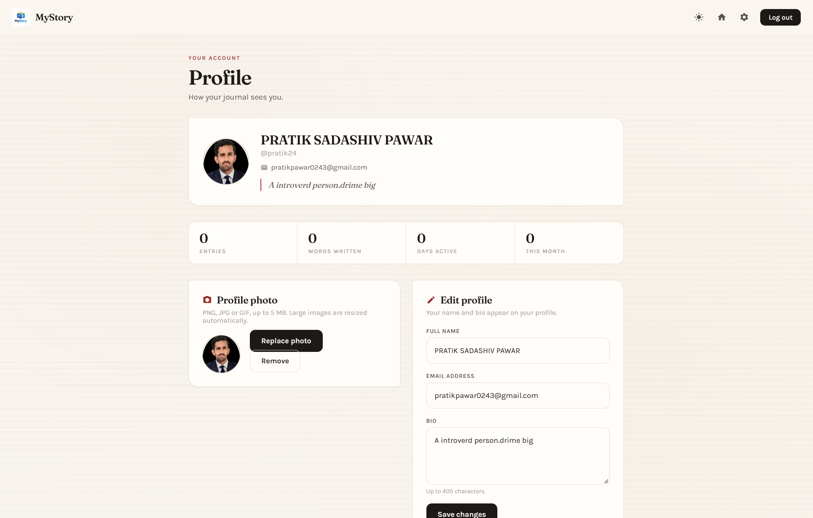

📓 MyStory (Spring Boot + JSP + MySQL)

A full-stack Journal Management Application built using Spring Boot, JSP, and MySQL.
Users can register, log in, and manage their personal journal entries.

------------

🚀 Features

📝 Create, view, and delete journal entries

👤 User registration and login system

🔗 REST API + JSP-based UI

💾 MySQL database integration (via JPA/Hibernate)

🎨 Clean frontend using HTML, CSS, and JavaScript

-----------

🛠️ Tech Stack

Backend
- Java 17

* Spring Boot 2.7

- Spring Data JPA (Hibernate)

Frontend
- HTML5

- CSS3

- JavaScript (Fetch API)

- JSP (Java Server Pages)

Database

- MySQL (phpMyAdmin)
---------


📁 Project Structure
```
journalApp/
│
├── src/main/java/net/engineeringdigest/journalApp/
│   ├── controller/
│   ├── service/
│   ├── repository/
│   ├── entity/
│
├── src/main/webapp/WEB-INF/jsp/
│   ├── index.jsp
│   ├── add.jsp
│
├── src/main/resources/
│   └── application.properties
│
├── pom.xml
```

-----------------
📦 API Endpoints
```
Auth APIs
POST   /api/auth/register   → Create account
POST   /api/auth/login      → Log in (sets JWT cookie)
GET    /api/auth/check      → Check current session
POST   /api/auth/logout     → Log out (clears JWT cookie)

Journal APIs
GET    /api/journal        → Get all entries
POST   /api/journal        → Create entry
DELETE /api/journal/{id}   → Delete entry
```
-------

<p align="center">
  <h4>Home</h4>
  
  <h4>Dashboard</h4>
  
   <h4>Profile</h4>
  
</p>
-------


🔐 Authentication (JWT)

Authentication is backed by JSON Web Tokens (HS256, via [jjwt](https://github.com/jwtk/jjwt)).

How it works:

1. `POST /api/auth/login` (and the JSP `POST /login`) verifies the credentials and returns a
   signed token in an `HttpOnly`, `SameSite=Lax` cookie.
2. `JwtAuthFilter` reads that cookie — or an `Authorization: Bearer <token>` header — on every
   request, verifies the signature and expiry, and loads the matching user.
3. Tokens carry only the username (`sub`) and user id (`uid`), so nothing about the user can
   go stale. An invalid, tampered, or expired token authenticates nobody.
4. `POST /api/auth/logout` and `GET /logout` expire the cookie.

Relevant configuration in `application.properties`:
```
jwt.secret=${JWT_SECRET:dev-only-secret-change-me-8f2b1c4d9e6a7b3f5c0d2e4a6b8c1d3f}
jwt.expiration-ms=86400000
jwt.cookie-name=journal_jwt
jwt.cookie-secure=false
```

> ⚠️ **Set `JWT_SECRET` in production.** The bundled default is a development placeholder —
> anyone who knows it can mint valid tokens. Also set `jwt.cookie-secure=true` when serving
> over HTTPS so the cookie is only sent on encrypted connections.

The standalone pages in `frantend/` run on a different origin and authenticate with
credentials, so `WebConfig` enables credentialed CORS for the local dev origins.
-------
⚙️ Setup Instructions

1️⃣ Clone Repository
```
git clone https://github.com/your-username/journalApp.git
cd journalApp
```
---------
2️⃣ Configure Database

Open phpMyAdmin and create a database:
```
CREATE DATABASE journaldb;
```
------
3️⃣ Update application.properties
spring.datasource.url=jdbc:mysql://localhost:3306/journaldb
spring.datasource.username=root
spring.datasource.password=

spring.jpa.hibernate.ddl-auto=update
spring.jpa.show-sql=true

4️⃣ Build Project
```
mvn clean install
```
5️⃣ Run Application
```
mvn spring-boot:run
```
OR
```
java -jar target/journalApp-0.0.1-SNAPSHOT.jar
```
--------

🧠 How It Works

- User interacts via JSP or frontend UI
- Request goes to Spring Boot Controller
- Service layer processes logic
- Repository communicates with database using JPA
- Hibernate converts Java objects → SQL queries

-------------------

🤝 Contributing

Feel free to fork this repo and improve the project!

--------
⭐ If you like this project, give it a star!
